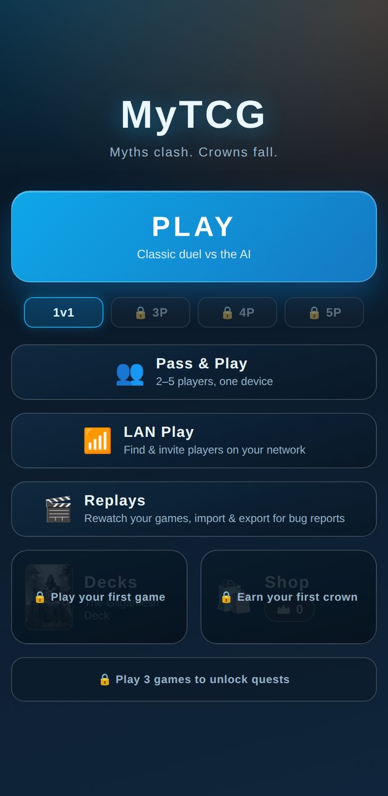
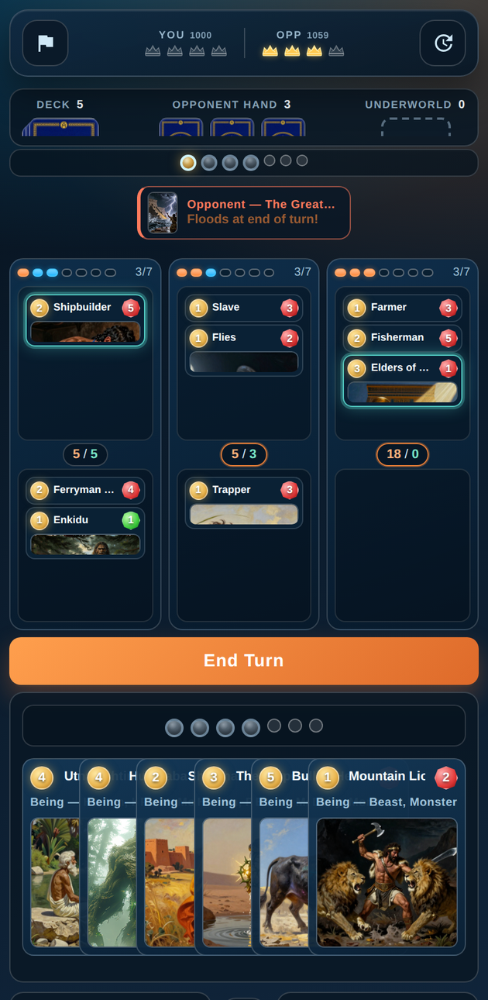
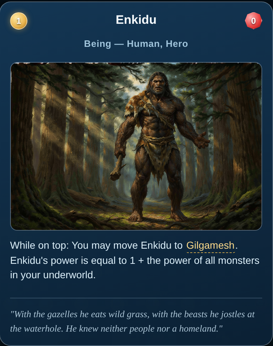

# My Trading Card Game

<p align="center">
  
  
</p>

This repository contains code to generate the print-ready cards for my trading card game,
plus the digital version of it: a browser app (FastAPI + plain ES modules), an offline
Android APK, and a Windows desktop build, all sharing one Python rules engine and its AI
opponents.
Read the rules for the game [here](rules/rules.pdf).

## Architecture

```
tables/, decklists/          Card data (CSV) — single source of truth
src/
  card_generator.py, ...     CSV -> SVG -> printable PDF pipeline
  server/
    engine/                  Game rules engine (pure Python, no dependencies)
      state.py               Immutable GameState dataclasses
      catalog.py             Card/deck loading + type predicates
      primitives.py          Generic zone/board operations (no card names!)
      effects.py             CardBehavior registry + reusable effect factories
      cards/                 One module per finished deck (gilgamesh, inanna,
                             flood, troy, odin, osiris) registering each card's behavior
      transitions.py         Rules runtime: turns, costs, triggers, victory
      snapshot.py            Player-visible JSON snapshots (server + mobile)
      sealed.py              Sealed cards: handles the host moves but cannot read
      sandbox.py             Sandbox mode: scenario edits on a live match
      replay.py              Match recording: version-proof replay files
      ai.py                  Search AI: greedy one-ply + positional evaluation
      policy.py              Neural featurization + torch-free inference
      training.py            Neural-network self-play training (PyTorch)
    model/policy_weights.json  Exported network (scripts/export_policy.py)
    services/, api/, main.py FastAPI server for the browser app
    services/lan.py          LAN + invite-code lobbies, seats, card trading
    webapp/                  Browser UI (master copy)
      js/p2p.js              Invite-code play: WebRTC, compact codes, fair seed
      js/qr.js               QR encoder (no dependencies) for invite codes
      js/mentalpoker.js      Encrypted shuffle: a deck nobody can read or stack
mobile-apk/                  Android app (Capacitor + Chaquopy)
scripts/sync_mobile.py       Copies engine/webapp/data into mobile-apk
tests/                       Pytest suite (invariants + per-card tests)
```

**Adding a new card effect:** implement it in the matching `engine/cards/<deck>.py`
module (or a new module — add it to `cards/__init__.py`). Reuse the factories in
`effects.py` (`tutor_named`, `revive_choice_on_enter`, `monster`, ...) and the
zone operations in `primitives.py`. Register interactive choices with
`register_choice` right next to the card. Never branch on card names inside
`transitions.py`.

**Owner vs controller:** ownership is fixed by the decklist
(`catalog.card_owner_idx`) and decides one thing only — whose hand, deck or
underworld a card returns to when it leaves play. Control is positional
(`primitives.controller_idx`): whoever's side of a location a card stands on
commands it, so a card that switched sides is counted, targeted, buffed and
activated for its new camp, and every "your"/"friendly" check reads the side.
Infiltrators (`CardBehavior.ability_follows_owner` — Sinon, Dolon, the Trojan
Horse, the Greek Soldiers) are the single exception: control of them passes,
but their own printed ability keeps resolving for the player who sent them.

**Editing engine/webapp/card data:** run `python scripts/sync_mobile.py`
afterwards — the copies under `mobile-apk/` are generated, never edit them by
hand. `tests/test_mobile_sync.py` fails if they drift.

## Tests

```bash
uv run --group dev pytest
```

- `tests/test_playout_invariants.py` — seeded random playouts of all finished
  deck pairings: termination, no crashes, capacity and card-conservation.
- `tests/test_card_effects.py` — targeted tests for individual card behaviors.
- `tests/test_sandbox.py` — sandbox mode: zone/stat edits, undo, and switching a
  live match into a sandbox.
- `tests/test_mobile_sync.py` — mobile tree matches the masters.

## Android APK (fully offline)

The app bundles the webapp (Capacitor) and the Python engine (Chaquopy);
gameplay needs no network at all.

**Prerequisites**

- Node.js (for `npm` / Capacitor)
- Android SDK (easiest via Android Studio); point
  `mobile-apk/android/local.properties` at it with **forward slashes**, e.g.
  `sdk.dir=C:/Users/<you>/AppData/Local/Android/Sdk` — the backslash-escaped
  form breaks Gradle.
- Java 21 (required by Capacitor 8). If your default JDK is older, use
  Android Studio's bundled one by setting `JAVA_HOME` for the Gradle step
  (see below).

**Build steps**

```bash
python scripts/sync_mobile.py         # 1. refresh engine/webapp/data copies
cd mobile-apk
npm ci                                # 2. install Capacitor CLI (once)
npx cap sync android                  # 3. copies www/ into the Android project and
                                      #    regenerates capacitor-cordova-android-plugins/
                                      #    (skipping this fails the Gradle build)
cd android
./gradlew assembleDebug               # 4. -> app/build/outputs/apk/debug/app-debug.apk
```

If your system JDK is not 21, run step 4 as:

```bash
$env:JAVA_HOME = "C:/Program Files/Android/Android Studio/jbr"; ./gradlew assembleDebug
```

Install `app-debug.apk` on your phone (enable "install from unknown sources").
Never edit files under `mobile-apk/` that have masters in `src/` — rerun
`python scripts/sync_mobile.py` instead (step 1) so the copies stay in sync.

Known limitation: mirror matches (both players using the same deck) are not
supported — card ownership is derived from decklists, so both sides would
resolve to player 1.

## Windows desktop build

Every push to `main` also packages a standalone `MyTCG.exe` (PyInstaller +
the FastAPI server, built by `.github/workflows/build-apk.yml`) and attaches
it to the same GitHub Release as the APK. Double-clicking it starts the
server and opens `/play` in your default browser — no Python install needed.

To build it locally on Windows:

```powershell
uv sync --group desktop
uv run python scripts/make_windows_icon.py
uv run pyinstaller --noconfirm --onefile --name MyTCG `
    --icon build/icon.ico --paths . `
    --add-data "tables;tables" --add-data "decklists;decklists" `
    --add-data "images/color;images/color" `
    --add-data "src/server/webapp;src/server/webapp" `
    --add-data "src/server/model;src/server/model" `
    --collect-all uvicorn --collect-all fastapi --collect-all starlette `
    scripts/desktop_app.py
```

-> `dist/MyTCG.exe`

## Multiplayer

Two ways to play a human, both under **Play with Friends** on the menu, and both
peer-to-peer: one player's instance is the authority for the match, the others
drive it through the ordinary `/api/state` and `/api/action` calls. There is no
server of ours anywhere in either path.

- **Same network (LAN).** Instances find each other by UDP broadcast, one hosts
  a lobby, guests join by address. `services/lan.py` owns discovery, lobbies
  and card trading.
- **Online (invite code).** For playing someone who is *not* on your Wi-Fi.
  WebRTC connects the browsers directly, but it first needs the peers to swap a
  connection description — normally a server's job. Here the players do it
  themselves, by passing a code over whatever chat they already use or by
  pointing one phone's camera at another's screen. `webapp/js/p2p.js` owns this.

Both seat 2–5 players. An invite-code host runs one connection per guest, so a
free-for-all is just more code swaps — "Invite another player" in the lobby.

Once a channel is open it carries the same JSON calls LAN play sends over HTTP,
so the lobby, the match and trading are all the shared code path — only the
transport differs (`api.js`, `P2P_HOST_BASE`).

### Invite codes

A browser's own connection description runs to ~600 bytes, nearly all
boilerplate. Only the ICE credentials, the DTLS fingerprint and the candidate
addresses carry information, so those are packed into a binary record and the
description is rebuilt from a template on arrival — safe, because the rebuilt
text is only ever handed to the *remote* browser. That takes a code from ~720
characters to about **170**.

It cannot go much lower. The fingerprint alone is 32 bytes and shortening it
breaks the DTLS handshake; with the ICE credentials and one address the floor is
around 130 characters. **A code short enough to memorise is not possible without
a lookup service**, which would mean a server. Instead every code is also
rendered as a QR (`webapp/js/qr.js`, written out rather than pulled in — the
webapp has no dependencies), and where the browser has `BarcodeDetector`
(Chrome on Android, which is where phone-to-phone actually happens) a **Scan**
button reads one straight off another screen.

### Provably fair shuffling

A match is a pure function of one integer seed (`create_initial_state`), so
whoever picks the seed picks the deal. Invite-code games agree it by
commit-reveal across every player:

1. Every player commits to a secret nonce — the host in the invite, each guest
   in their reply — publishing only its SHA-256.
2. Once everyone is seated the host broadcasts the **complete** set of
   commitments.
3. Only then does anyone reveal. The seed is the hash of all nonces in seat
   order.
4. Every player checks every commitment against its reveal, and **refuses to
   play** on a mismatch.

Publishing all commitments before any reveal is what makes it sound for more
than two players: no player — and no coalition of host plus confederate — can
choose a nonce after seeing somebody else's. The agreed seed is applied at
start, not when the lobby opened, since the rounds cannot finish until everyone
has joined (hence the `seed` argument to `LanService.start_game`).

### Hidden information: mental poker

`webapp/js/mentalpoker.js` implements the shuffle that makes a deck unreadable
even to the machine running the match. Unlike poker, every deck here belongs to
one player and its *contents* are public — the secret is the **order**, and a
real shuffle leaves that unknown to everyone, the owner included.

The construction is the classic one (Shamir–Rivest–Adleman): work in the
quadratic residues modulo a safe prime, where raising to a power commutes, so
players' key layers can be peeled off in any order.

1. **Shuffle round** — each player in turn encrypts every card under one key and
   permutes. Afterwards the order is the composition of everyone's
   permutations, so no single player knows it.
2. **Re-keying round** — each player swaps their shuffle key for one key per
   *position*, so cards can be opened individually.
3. **Drawing** — to give position *k* to its owner, everyone else publishes just
   their key for *k*. Nobody else learns a thing.
4. **Public reveal** — the owner publishes too, and any player can *verify* the
   claim by recomputing it. A player cannot lie about a card they hold.
5. **Search effects** — `tutor_from_deck` necessarily shows a player their whole
   deck, exactly as searching does on a table. That is fine provided the deck is
   shuffled again afterwards, which the engine already does; re-running steps
   1–2 restores the invariant.

The group is the 1536-bit RFC 3526 prime. Size is a speed decision and a sharp
one, because the deck must pass through every player twice: measured in-browser,
setting up five players costs ~1.8s at 1024 bits, **~4.6s at 1536**, and ~10.3s
at 2048, while a duel is ~0.4s at 1536. That is a comfortable margin for a
secret an opponent would have to break *during the match* and which is worthless
the moment it ends. Raising it to 2048 is a one-line change.

**What is proved and what is not.** Reveals are verifiable, and a dishonest
shuffler cannot *choose* which card lands where — the values it permutes are
already encrypted under other players' keys. It could duplicate a position, and
that is caught by `auditDeck` when every key is published at the end of the
match, rather than prevented during it. Closing that gap needs a zero-knowledge
shuffle proof.

**Sealed cards.** The engine side of this is `engine/sealed.py`: a *sealed* card
is a handle to a position in a pile the host cannot read — `#1-14` is seat 1's
ciphertext position 14 — which it can still draw, discard, mulligan and shuffle,
because moving a handle needs no idea what is under it. Handles are public on
purpose: the order was decided inside the protocol, so permuting them leaks
nothing. `catalog.card()` raises `SealedCardError` for a handle rather than
returning a blank card, so a rule that reaches for an identity the host is not
allowed to have stops where a reveal can be asked for instead of quietly
deciding your hidden card is not a Human. `sealed.py` also holds the *checking*
half of the protocol (the browser proves, the host verifies), pinned to the JS
by vectors that JS generates: `scripts/gen_mentalpoker_vectors.mjs` →
`tests/data/mentalpoker_vectors.json` → `tests/test_sealed.py`.

> **Status: foundations in, not yet dealing.** Done: the protocol module, the
> Python verifier, sealed handles through deal/mulligan/draw/snapshot, and
> `transitions.reveal_sealed` as the seam a reveal comes in through. Today's
> invite-code games still deal in the clear (`create_initial_state(sealed_deal=False)`)
> and get the verifiable *seed* but not the encrypted *deck* — nothing about
> them has changed yet. What remains: running the shuffle across the players at
> match start; reveal-on-play, so a card becomes an action by being opened;
> clients opening their own draws locally; deck searches, which must reveal a
> pile publicly and then re-shuffle it; and the end-of-match audit.

### Guests are not trusted with the whole API

A guest may only call the routes a player actually needs
(`P2P_GUEST_PATHS` in `menu.js`) — notably not `/api/lan/start`, and not the
sandbox routes, which can edit a live match at will.

### STUN

Home routers hide players behind NAT, so each peer needs to learn its own public
address. That is what the STUN servers in `p2p.js` do: free, public, stateless,
and never in the path of game traffic. Point at different ones — or use none,
which limits play to a shared network — by setting `localStorage.mytcg_p2p_ice`
to a JSON array of RTCIceServer entries. A small share of NAT pairings cannot be
traversed with STUN alone and would need a TURN relay, which is a server; those
connections simply fail to open.

Invite-code games cannot reconnect: the route to the host is a live channel
rather than an address, so a drop ends the match and the menu offers no rejoin
(LAN guests still get one).

## AI opponents

The mobile app and the server share the same AI code in the engine:

- **Minimax AI** (`engine/ai.py`, the strongest): depth-limited alpha-beta
  over action steps — it sees the rest of its own turn and the start of the
  opponents' replies. Used for balance runs and the top of the Elo ladder.
- **Search AI** (`engine/ai.py`): greedy one-ply search — it simulates every
  legal action and picks the best resulting position (victory points,
  weighted lane control, power margins, card advantage). Runs instantly,
  fully offline, no dependencies.
- **Neural policy**: trained with `training.py`, exported via
  `scripts/export_policy.py` to `src/server/model/policy_weights.json`, and
  evaluated without torch by `engine/policy.py` (works on Android).

**Rated opponents (the Elo ladder).** In the app every opponent is a rated
player: the client samples each AI's Elo near the player's own rating and
sends it as `ai_elo` to `/api/ai-move`; `engine/ladder.py` then plays a
per-move mixture of the agents above so strength is a continuous function of
that number. Anchors (calibrated by arena cross-play, search fixed at 1200):
random 440, neural 740, search 1200, minimax 1330. The player has ONE rating
across all modes — a 1v1 counts like one Elo game, an N-player FFA as
pairwise games against every rival by final placement, with the K factor
split so both move the rating equally. The rating lives in the local profile
(`webapp/js/elo.js`, `profile.js`) and is shown next to the crowns
("YOU 1200 | OPP 1213") and on the game-over overlay ("+12 Elo → 1213").

**Current benchmarks** (arena cross-play, 2026-07-15, after the strategic
combo evaluation landed in `engine/ai.py`): minimax beats search 68%, search
beats neural 93% and random 99%. The neural policy is still the weakest
trained tier — see "Training the AI & balancing the decks" below to improve
it.

## Sandbox mode (playtesting inside a real game)

Sandbox mode is not a separate mode with a screen of its own: it is a switch you
throw *inside* a normal game against the AI. Open the **history sheet** (the
clock icon, top right), scroll past the log, and tap **🧪 Activate Sandbox
Mode**. The board, the rules and the AI stay exactly what they were — the game
screen just grows a few affordances:

- **A sandbox card at the end of your hand.** Tap it for the toolbox: add any
  printed card to your hand, draw, discard, hand a seat to the AI or take one
  over, undo the last step, or open any seat's zones.
- **Every pile is editable.** Tap your own or the opponent's hand, deck or
  underworld to see what is really in it (decks in draw order) and act on a card:
  return it to hand, put it on top of or under a deck, send it to the underworld,
  put it in play on either side of any location, banish it out of the game, nudge
  its power, or flip it face down. Adding a card the other seat already owns mints
  a copy that plays exactly like the original.
- **A 🧪 button on every location.** Add a card to either side, move or banish
  what is standing there, clear a side, or protect the location from the flood.
- **Mana and crowns, one by one.** Tap a mana gem to spend or refresh exactly
  that one (and the seat's cap follows if you go past it); tap a crown in the
  score panel to set the count. Both also have a menu with ±1 / refresh / spend
  all.
- **Switch control or let the AI play.** Taking a seat over flips the board to
  its point of view — its hand included — and hands every other seat to the AI so
  the match keeps flowing. Any seat's AI can be switched off to drive two seats by
  hand, and "let the AI play this turn" plays a single move for the seat you hold.
- **Undo.** Every edit, play and AI move is one step on the match's undo stack.
- **Escape hatches**: skip the mulligan, cancel a pending choice, and play on
  after a match has already ended.

Nothing in a sandbox match touches the profile: no Elo, no crowns banked, no
quests, no matchup stats. The switch stays in the history sheet to put the tools
away again (the edits stay); the next match is a normal match.

Implementation: `engine/sandbox.py` (the edits and the omniscient view, shared
with Android), `services/game_service.py` (`enable_sandbox`, `apply_sandbox_ops`,
`undo_sandbox`), `api/endpoints.py` (`/api/sandbox/*`), `webapp/js/sandbox.js`
(the tools). Headless use:

```python
from server.engine import sandbox
from server.services import GameService

service = GameService()
service.create_match("scratch", seed=7, deck_a="epic_of_gilgamesh", deck_b="siege_of_troy")
service.enable_sandbox("scratch")
service.apply_sandbox_ops("scratch", [
    {"op": "skip_mulligan"},
    {"op": "add_card", "card_name": "Gilgamesh", "zone": "location", "player_id": 1, "location_id": 1},
    {"op": "set_stat", "stat": "mana_pool", "player_id": 1, "value": 7},
])
print(sandbox.reveal_all(service._matches["scratch"].state)["seats"][0]["hand"])
service.undo_sandbox("scratch")
```

## Replays (and how to report a bug with one)

Every match records itself. A finished game is saved automatically; a game that
is still running can be saved from the **history sheet** (the clock icon, top
right) with **🎬 Save replay** — which is the case that matters, because a match
wedged by a bug never reaches game over. Saved games live under **Replays** on
the main menu, where they can be watched step by step, exported, and imported.

**A replay is a recording, not a script.** Playback never re-runs the rules. Each
step stores the board exactly as it was, and the file bundles the card printings
(name, effect text, cost, power, type) that were in force while the match was
played. So a replay taken on an older build still shows *that* build's Achilles —
his old stats, his old effect, and the numbers the old engine actually computed —
no matter how far the cards have moved on since. That is what makes a replay
attachable to a bug report weeks later.

The player shows everything a live game hides: every seat's hand, every deck in
draw order, live power per card and per side, the cost each hand card had at that
instant, and the pending choice the engine was waiting on. Tap any card to read
it as it was printed then; tap a line in the log to jump to the step that wrote
it. The header carries the build that recorded the match and a fingerprint of its
card data, so two replays that disagree can be told apart at a glance.

**Export/import.** Export hands the file to the system share sheet, a download,
or the clipboard — whichever the platform allows. The file is plain JSON
(`.mytcgreplay`), readable without the app. Import takes that file, or the
compact gzipped share code that **Paste code** reads, which is small enough to
paste into an issue. A file from a newer format version is refused with a clear
message instead of being half-rendered.

Implementation: `engine/replay.py` (the recorder, the frame format, the card
table — shared with Android), `services/game_service.py` (`replay`),
`api/endpoints.py` (`/api/replay`), `webapp/js/replay.js` (format, library,
import/export) and `webapp/js/replayview.js` (the screens). Frames are stored as
deltas against the previous step, which keeps a full match well under 100 KB.
Headless use:

```python
from server.engine.replay import expand_frames
from server.services import GameService

service = GameService()
service.create_match("scratch", seed=7)
# ... play the match through submit_action / apply_ai_action ...
replay = service.replay("scratch", app_version="dev")
steps = expand_frames(replay)          # one complete board per step
print(steps[-1]["state"]["victory_points"], steps[-1]["log"][-1])
print(replay["cards"][some_card_id])   # the printing as it was, not as it is
```

## Training the AI & balancing the decks

The six finished decks and their registry ids:

| Deck                                 | Registry id         |
| ------------------------------------ | ------------------- |
| Epic of Gilgamesh                    | `epic_of_gilgamesh` |
| Inanna's Descent to the Underworld   | `inannas_descent`   |
| Siege of Troy                        | `siege_of_troy`     |
| The Great Sumerian Deluge            | `the_flood`         |
| Odin's High Seat                     | `odins_high_seat`   |
| The Osiris Myth                      | `the_osiris_myth`   |

### 1. Train the AI

Training needs PyTorch (CPU is fine). 2000 episodes take ~2–3 minutes:

```bash
uv sync --group ai        # once — installs torch + training dependencies

uv run python -m src.server.ai.train_distributed \
    --episodes 2000 --num-actors 8 --episodes-per-update 32 \
    --decks epic_of_gilgamesh,inannas_descent,the_flood,siege_of_troy,odins_high_seat,the_osiris_myth \
    --pipeline-mode shared_memory \
    --league-sample-prob 0.5 --league-pool-size 16 --league-add-every-updates 5 \
    --elo-csv stats/ai_training_elo_distributed.csv \
    --checkpoint-path stats/checkpoints/ai_nn_distributed_latest.pt \
    --device auto
```

```powershell
uv run python -m src.server.ai.train_distributed `
    --episodes 2000 --num-actors 8 --episodes-per-update 32 `
    --decks epic_of_gilgamesh,inannas_descent,the_flood,siege_of_troy,odins_high_seat,the_osiris_myth `
    --pipeline-mode shared_memory `
    --league-sample-prob 0.5 --league-pool-size 16 --league-add-every-updates 5 `
    --elo-csv stats/ai_training_elo_distributed.csv `
    --checkpoint-path stats/checkpoints/ai_nn_distributed_latest.pt `
    --device auto
```

Then export the checkpoint so the torch-free runtime (server + Android) can
use it, and sync it into the mobile tree if you want it in the APK:

```bash
uv run python scripts/export_policy.py   # -> src/server/model/policy_weights.json
python scripts/sync_mobile.py
```

### 2. Let the AIs battle: the balance arena

`python -m src.server.ai.arena` plays a large batch of AI-vs-AI games across
every pairing of the finished decks (seats alternate, starting player is
randomized) and prints the statistics needed for card balance decisions:

```bash
# 1000 games over all pairings with the minimax AI (the strongest agent,
# the default) — finishes in under a minute, no torch required
uv run python -m src.server.ai.arena --games 1000

# other agents: search (greedy one-ply), neural (reads the exported
# policy_weights.json), random
uv run python -m src.server.ai.arena --games 1000 --agent search

# useful flags
#   --mirrors               also play mirror matches (extra per-card data)
#   --agent-b neural        asymmetric: seat A plays --agent, seat B --agent-b
#                           (also prints the head-to-head score and Elo gap)
#   --decks a,b             restrict to a subset of decks
#   --weights path.json     alternative exported weights for --agent neural
#   --workers 8             parallel processes (default: CPU count - 1)
#   --seed 7                different game seeds
#   --out stats/my.json     where raw per-game records are written
```

Agent strength, measured with exactly these asymmetric runs (search anchored
at 1200): random 440 < neural 740 < search 1200 < minimax 1330. These are the
ladder anchors in `engine/ladder.py` / `webapp/js/elo.js` — re-run the
pairings and update both files whenever an agent changes.

The printed report contains:

- **Deck win rates** (mirrors excluded, draws = 0.5) and the full
  **matchup matrix** — who beats whom, by how much, per pairing.
- **First-player advantage**, overall and per deck.
- **Game length** (average rounds) per pairing plus step-cap draw counts.
- **Card impact per deck**: plays per game, how often the card is played at
  all, win rate when played vs when not played, and the delta between the
  two. A big positive delta flags cards that may be too strong; a negative
  delta or a very low play rate flags cards that need a buff or cost change.

Raw per-game records (decks, winner, rounds, final VP, every card played)
are also saved as JSON (default `stats/arena_results.json`) for deeper
custom analysis.

### 3. Automated stat tuning: the balance search

`python -m src.server.ai.balance_search` automates the "±1 power" grind: it
hill-climbs the printed power numbers toward a meta where every deck wins
close to 50% **and** every card pulls its weight inside its own deck. The
objective it minimizes is

    sum((deck win rate − 0.5)²)  +  card_weight · mean(card impact delta²)

so a deck cannot be "balanced" by one overpowered carry card — large
per-card impact deltas (win rate when played vs not played, the same number
the arena report prints) are penalized alongside uneven deck win rates.

Each iteration it plays a screening batch, reads the card-impact table to
propose a handful of targeted power tweaks (nerf the strongest deck's
highest-delta cards, buff the weakest deck's dead weight, flatten the
biggest delta outliers in any deck), replays the SAME game seeds for every
candidate so they differ only by the tweak, and keeps the best one. Costs
are deliberately never touched — cost changes interact with mana curves and
free-play combos in degenerate ways (a 0-cost revive piece "balances" the
numbers while ruining the game), so costs stay a human decision. Tweaks are
applied in memory only — no CSV is modified and card ids stay stable — and
the final card set is re-validated with the minimax agent.

```bash
# ~15 min with the defaults: 8 iterations, 1000 games per evaluation,
# screening with the fast search agent, final 1000-game minimax validation
uv run python -m src.server.ai.balance_search

# useful flags
#   --iterations 12         more hill-climbing steps (each accepts <=1 tweak)
#   --games 2000            more games per screening batch (less noise)
#   --agent minimax         screen with minimax too (much slower, most faithful)
#   --validate-games 2000   bigger final validation batch (0 = skip)
#   --breadth 4             candidates per angle (nerf/buff/outlier) per iteration
#   --max-delta 2           never drift a power more than this from the CSV value
#   --card-weight 1.0       weight of the per-card delta term in the objective
#   --vanilla-weight 0.01   penalize pushing a card ABOVE the vanilla line (see below)
#   --vanilla-slope 2.0     vanilla line slope (power per unit cost)
#   --vanilla-intercept 0   vanilla line intercept (power at cost 0)
#   --decks a,b             tune a subset of decks
```

It prints the accepted tweak per iteration (with the objective split into
its deck and card components) and finishes with a list of suggested CSV
edits (e.g. `Trapper  Power 2 -> 3`) plus a search log in
`stats/balance_search.json`. Apply the edits to `tables/religion/**.csv` by
hand, run the tests, and `python scripts/sync_mobile.py` — the tool
deliberately never writes the CSVs itself. Two caveats to keep in mind: win
rates from 1000-game batches carry ~±2pp of noise, so treat single accepted
tweaks as suggestions rather than proof, and the search only optimizes win
rates — it cannot tell whether a nerf makes a card boring, so review the
suggestions before committing them.

**The vanilla guardrail (`--vanilla-weight`).** By default the search moves
power freely, which risks "fixing" a deck that is actually mis-built by
inflating its cards past what their cost should buy. Turning on
`--vanilla-weight` (start around `0.01`) adds an **asymmetric** penalty for
pushing a card's printed power *above* the vanilla line
(`power = slope*cost + intercept`, defaulting to the game's `2*cost`
baseline). Sitting *below* the line stays free — that is exactly what pays
for a card's effect — so the search can still nerf and buff toward 50%, but
it can no longer quietly turn a 4-cost/7 into a 4-cost/10 to rescue a badly
constructed deck. Use it together with the deck diagnostics below.

### 4. Deck diagnostics: construction vs. card power

`python -m src.server.ai.deck_diagnostics` answers a question the arena and
the balance search cannot: **is a deck losing because its cards are
mis-costed, or because of how it is built** (bad curve, dead cards, effects
that need setup)? Buffing power numbers fixes the first and only *hides* the
second, so separate them before you tune.

```bash
# read each deck against the 2*cost vanilla line, merging the latest arena
# play/win data from stats/arena_results.json
uv run python -m src.server.ai.deck_diagnostics

# fit the vanilla line your existing cards already imply, instead of 2*cost
uv run python -m src.server.ai.deck_diagnostics --fit

# useful flags
#   --slope 2 --intercept 1   set the vanilla line by hand (power = slope*cost + intercept)
#   --arena stats/my.json     a different arena results file (omit/missing = skip play data)
#   --decks a,b               a subset of decks
```

For every deck it prints:

- the **cost curve** and a **curve check** that flags real problems — cost
  holes, a lopsided pile at one cost, and bodies with `<=0` power that make
  the curve "play thinner than it looks";
- a **curve-out tempo** line: the vanilla power a perfect draw could put on
  the board by each turn (mana `= min(7, turn)`, no carryover). This is the
  pure construction metric — it ignores every effect, so it is a floor and a
  fair cross-deck comparison;
- every card's **effect budget** (`power - vanilla(cost)`): cards *above* the
  line are over-statted (real nerf targets); cards far *below* are paying
  stats for an effect that then has to earn them back;
- merged **play rate + win delta** from the arena, ending in a **verdict**
  split into CONSTRUCTION vs CARD POWER buckets.

One statistical caveat the report repeats: the arena win-delta is confounded
by game length (winning games run longer and play more cards, so almost every
card shows a positive delta). Trust play rate and *negative* deltas; a
positive delta is close to meaningless on its own.

**The vanilla power line.** A no-effect being's printed power should follow a
line in its cost. The game's one true vanilla card, Craftsmen of the Ark
(cost 3, power 6), pins the designer baseline at `2*cost`; effects then buy
power *down* from that line. Because this is a board-control game (win by the
highest power at capacity-limited locations, mana ramping 1/turn with no
carryover, a short 7-round game), card economy and slot concentration already
favor big bodies — so the balanced line is roughly linear with a small
positive intercept, **not** convex. A cost-5 vanilla should sit around 8–10,
not 12. Reference lines:

| cost                    | 1 | 2 | 3 | 4 | 5 | 6  | 7  |
| ----------------------- | - | - | - | - | - | -- | -- |
| `2*cost` (baseline)     | 2 | 4 | 6 | 8 | 10| 12 | 14 |
| `2*cost + 1` (favors small, recommended) | 3 | 5 | 7 | 9 | 11| 13 | 15 |
| fitted from these decks (`~1.6*cost + 0.4`) | 2 | 4 | 5 | 7 | 9 | 10 | 12 |

The `+1` intercept is the one correction pure `2*cost` misses: it is the
fixed "cost of being a card" (each body spends a card and a lane slot
regardless of size), which is why cheap cards deserve slightly more power per
mana than the naive line gives them.

## Setup with uv

1. Install [uv](https://docs.astral.sh/uv/).
2. From the repository root, create and sync the virtual environment:

```bash
uv sync
```

3. Run the main generation pipeline:

```bash
uv run python main.py
```

Optional commands:

```bash
# Start the FastAPI server
uv run uvicorn src.server.main:app --reload

# Install dev dependencies
uv sync --group dev

# Train distributed neural AI (module entrypoint under src)
uv run python -m src.server.ai.train_distributed --episodes 2000 --num-actors 8 --episodes-per-update 32 --decks epic_of_gilgamesh,inannas_descent,the_flood,siege_of_troy,odins_high_seat,the_osiris_myth --pipeline-mode shared_memory --league-sample-prob 0.5 --league-pool-size 16 --league-add-every-updates 5 --elo-csv stats/ai_training_elo_distributed.csv --checkpoint-path stats/checkpoints/ai_nn_distributed_latest.pt --device auto
```

Training artifacts are written to `stats/` by default.

WebSocket endpoint for action protocol:

- `/ws/action`

Example payload:

```json
{
	"match_id": "default",
	"player_id": 1,
	"action_kind": "draw_card",
	"seed": 42,
	"deck_a": "echoes_of_the_storm",
	"deck_b": "flames_of_annihilation"
}
```

## Play Against Trained AI (Web App)

1. Start the API server:

```bash
uv run uvicorn src.server.main:app --host 0.0.0.0 --port 8000 --reload
```

2. Open the browser UI:

- http://localhost:8000/play

3. In the UI:

- Set `checkpoint_path` to a model file you want to use.
- Click `Start / Refresh`.
- Drag cards from your hand onto your side of a location to play them. Dragging
  is the only way to play a card; tapping one opens it full size instead, so a
  stray tap can never commit a play.
- Card visuals are rendered from SVG assets in `output_svgs/` (served at `/assets/cards`).
- Use `Run AI Move` (single action) or `Run AI Turn` (AI continues until your turn).

HTTP routes used by the UI:

- `POST /api/state`
- `POST /api/action`
- `POST /api/ai-move`

Legacy draw endpoint remains available at `/ws/draw`.

`tables/all_cards.csv` contains the table with all cards in the game.
Call `main.py` to read the csv and generate `.svg` files from it.

We can also generate box designs for starter decks.

## ToDos
### Physical game
- ~180 cards with mesopotamian mythology (3 mono-color starter decks. 3 dual-color starter decks. = 90 cards in decks, rest for drafting)
- Red Destroy, Green Farming, Blue Flood
- RG Revive, RB On return, GB Top-card for free,  

### Mythology
Ziusdra (Eridu Genesis) - 
Atrahasis - Human overpopulation
Utnapishtim (Epic of Gilgamesh) - becomes Immortal
Noah - Builds ark
Chinese Flood Myth - Build Dykes
Manu Vaivasvata Flood - Build boat, sail to himalaya


### Expansion Ideas
- Wide creatures
- Creatures with Lines
- Two-sided cards
- Fusion creatures
- Pilot creatures
- Ambush creatures
- Equipments
- Quest cards that give a bonus if you complete them
- Extra Drafting Rule cards (Time Periods) like Edo, Heian, High Middle ages, Sumerian, Pax Romana. Rules like: 

`src/box_generator.py` generates boxes for starter decks. Do not print these boxes directly, first you must export them to `.png`.


## Card types

<p align="center">
  
</p>

### Beings
Creatures are the core card type of this game. They cost mana and give power. They are played on a location.

### Locations
Every deck may bring 5 locations. One of them is used as one of the outside locations since the start of the game.

### Equipments
Place equipments on top of played creatures to make them better.

### Curses
Curses are given to your opponents.

### Heroes
You may start with a hero.
To use the hero's ability, you must pay one victory point and the mana cost on the hero card.

## Quests
Give a reward after a condition is fulfilled, like move one of your creatures 5 times.


## TODOs 

### Gameplay

- How to make sure that The Flood Decks actually play humans?

### Future Features

- Add some Sound Effects. We can include a ComfyUI Workflow that generates Sound Effects. We should have Sound Effects for getting a crown, getting a coin, start of turn, mulligan and shuffling, end of turn, winning, losing, and each card should have their own sound/ battlecry when they are getting played, being banished, being revived, and being discarded. If there are any sound effects that make sense also add them.
- Add theme music
- Add local multiplayer, for 1v1 and the FFA modes

### Long Term Roadmap
- Draft Mode
- Puzzle Challenges
- Story Mode
- Roguelike Mode

- LAN Multiplayer
- LAN Card Trading

### Bugs
